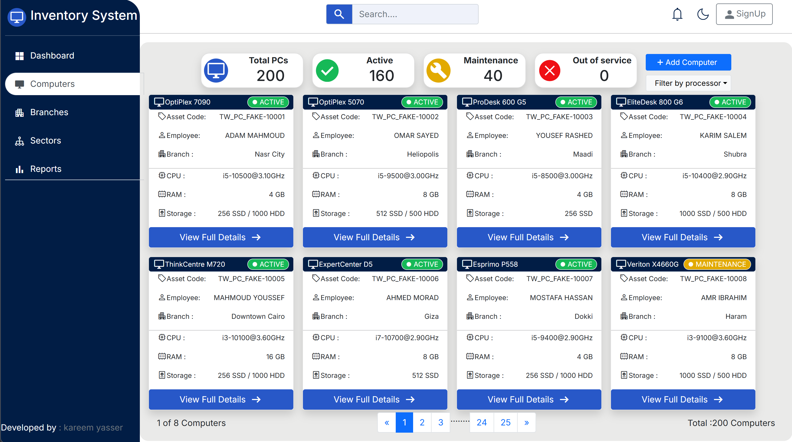
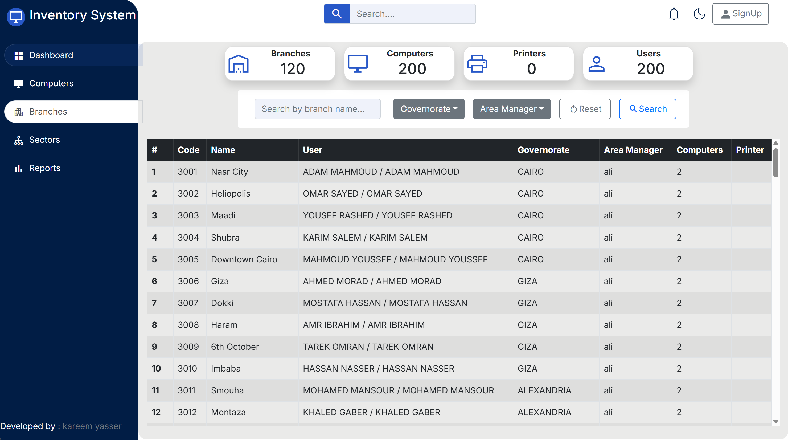
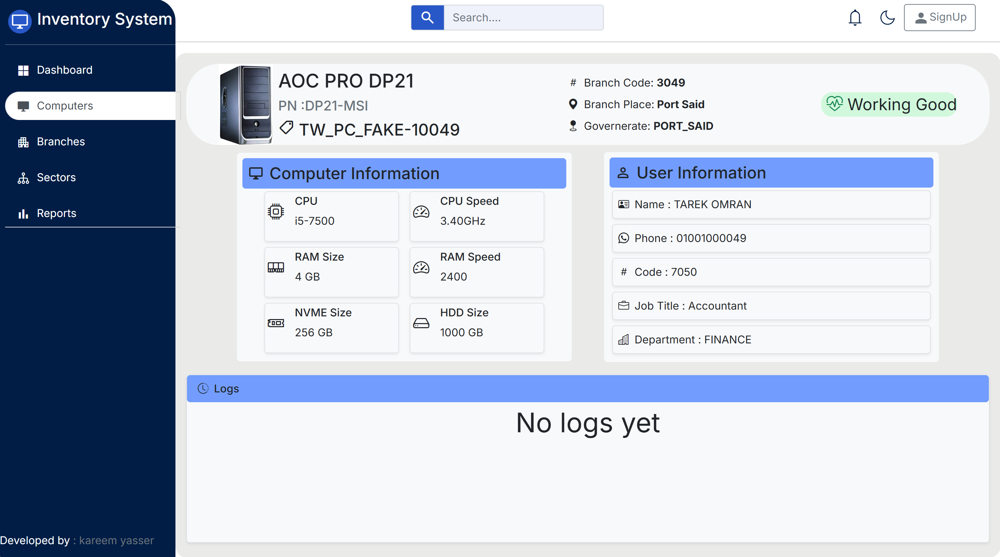

# Inventory PC

A full-stack web application for managing and tracking company IT assets such as computers, employees, and branches.

The project is being developed incrementally, with each phase adding new inventory management capabilities.

## Current Status

**Phase 1 — v0.1.0**

Phase 1 focuses on the initial inventory dashboard and read-only asset information.

### Implemented

* Computers listing
* Computer search and filtering
* Computer details page
* Computer specifications
* Employee information and computer assignment
* Asset and product number display

## Screenshots








## Tech Stack

**Frontend:** React, TypeScript, Vite, Bootstrap, CSS, React Router
**Backend:** Java, Spring Boot, Spring Data JPA, MySQL
**Tools:** Git & GitHub, Postman, Docker

## Main Features

**Branches:** Branch code, branch name, governorate, number of computers, and assigned employees.

**Computers:** Asset code, product number, brand, RAM, storage, employee, branch, and device status.

**Computer Details:** PC image, hardware details, employee information, branch information, and a logs section prepared for future development.

> **Note:** The Logs section is frontend-only at this stage.

## Phase 2 — v0.2.0 — Upcoming

Employee management page and improvements to the frontend and application logic.

## Project Structure

```text
inventoryPC-fullStack/
├── 01-back-end/
│   └── Spring Boot application
│
└── 02-front-end/
    └── pc-inventory/
        ├── src/
        ├── public/
        └── package.json
```

## Project Goal

The goal of Inventory PC is to provide a centralized system for tracking company IT assets and their assignments across different branches.

The application is being developed as a real-world full-stack project through gradual development and deployment.
